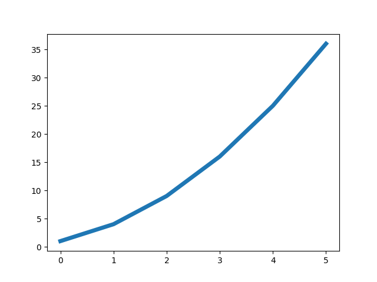

# Plotting a simple Line graph

## Steps

### prequisities

#### install packages

    pip install matplotlib

## plotting a simple line graph

<code>
    import matplotlib.pyplot as plt

    squares =[1,4,9,16,25]
    fig, ax = plt.subplots()
    ax.plot(squares)

    plt.show

</code>

### Explanation

    1. first import the pyplot module using the alias plt so we don’t have to type pyplot repeatedly
    2. create a list called squares to hold the data that we’ll plot.
    3. calling the subplots() can generate one or more plots in the same figure.
    4. The variable fig represents the entire figure or collection of plots that are generated.
    5. The variable ax represents a single plot in the figure
    6. plot() method will try to plot the data it’s given
    7. The function plt.show() opens Matplotlib’s viewer and displays the plot

### Expected Results

    If Everything works correctly the following should be the sample output/result
    Your outpust should appear as shown below

###### NOTE:

    In order to increase the linewidth for better visualization
    change the code to

<code>
    import matplotlib.pyplot as plt
    
    squares =[1,4,9,16,25, 36]
    fig, ax = plt.subplots()
    ax.plot(squares, linewidth=5)
    plt.savefig('output.png')
    plt.show()

</code>
